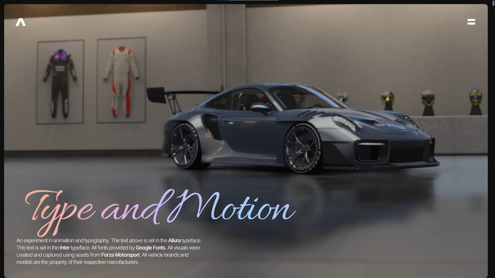

# Type & Motion

This project is a typography and scroll animation study showcasing a series of luxury performance cars through animated typography and modern aesthetics and subtle motion. 
The goal was to experiment with layout, type pairing, and smooth scroll-driven animations using Framer Motion. Built using HTML/CSS, JavaScript, Tailwind, Framer Motion, and Next.js and deployed using Vercel. 

## Preview

[type-and-motion.vercel.app](https://type-and-motion.vercel.app)

